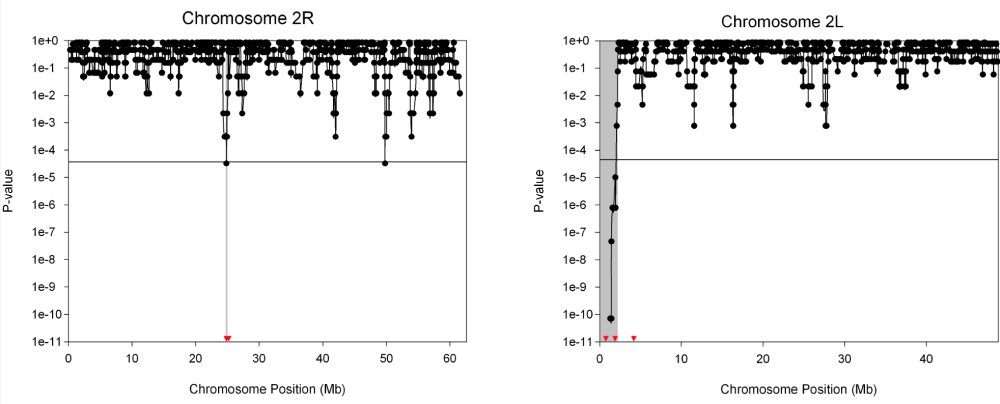
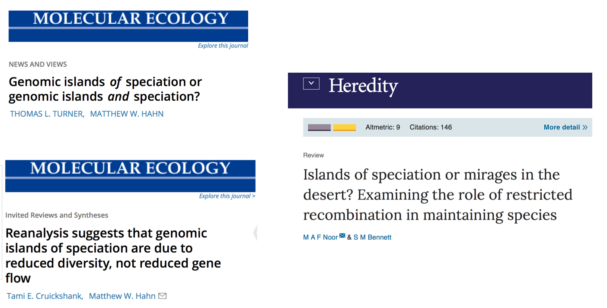

```{r setup, include = F}

rm(list=ls())

#Load knitr
library(knitr)

#Set some options
options(na.action='na.fail')
opts_knit$set(root.dir = '..')
opts_chunk$set(echo=FALSE,
               warning=FALSE,
               message=FALSE,
               fig.width=8,
               fig.height=8)

set.seed(200285)
```


```{r load and clean, include = F}
#Load and clean data
source("Scripts/SpurginBosse_Hapmap_LOAD.r")
source("Scripts/SpurginBosse_Hapmap_FUNCTIONS.r")
source("Scripts/SpurginBosse_Hapmap_CLEAN.r")
```


##Hapmap update

So far...

- Draft completed
- Jon and Mirte been through it

<br>

To do...

- Sort pitch
- Decide on final analyses
- Write up and submit


##Islands of speciation

Turner & Hahn 2005, *PLoS Biol.*

<center>

</center>


##Islands of speciation


<center>

</center>


##Islands of speciation

- Are islands of speciation real?
- Islands of speciation/differentiation/divergence?
- Is gene flow required for islands to form?
- Is it all reduced recombination?
- Should we use $F_{ST}$ or $d_{xy}$ to measure divergence


##Beyond islands of speciation

How does divergence build up across the genome and how do different evolutionary forces contribute to this?

- Selection
- Gene flow
- Drift
- Recombination

**Few studies on build up of genomic divergence along known colonisation routes**

##Hapmap samples

```{R map,fig.width = 5,fig.height = 5,fig.align = "center"}
Fig1A <- get_map(location = c(-11,31,40,66),zoom = 4,maptype = "watercolor",color = "bw") %>%
  ggmap()+
  geom_point(data = ll,aes(x = Long,y = Lat),col = "red")+
  xlab("Longitude")+
  ylab("Latitude")


Fig1A

```


##Hapmap aims

- Determine colonisation route of GT throughout Europe
- Look at how divergence across the genome accumulates along the colonisation route
- Understand where (and why?) selection has operated (both "where" in the genome and "where" in Europe)


##Phylogeography

```{r phylogeography,fig.width = 7,fig.height = 5,fig.align="center"}


Fig <- rbind(pd[,c(1:3)],
               data.frame(p1 = unique(c(pd$p1,pd$p2)),p2 = unique(c(pd$p1,pd$p2)),FST = rep(0,length(unique(c(pd$p1,pd$p2))))),
               data.frame(p1 = pd$p2,p2 = pd$p1,FST = pd$FST)) %>%
  mutate(pd,p1 = factor(p1,
       levels = c("Loch_Lomond_Scotland",
                  "Cambridge_UK",
                  "Wytham_UK",
                  "Mariola_Spain",
                  "Font_Roja_Spain",
                  "La_Rouviere_France",
                  "Montpellier_France",
                  "Antwerp_Belgium",
                  "Vlieland_Netherlands",
                  "Westerheide_Netherlands",
                  "Zurich_Switzerland",
                  "Radolfzell_Germany",
                  "Seewisen_Germany",
                  "Pirio_Muro_Corsica",
                  "Sardinia",
                  "Italy",
                  "Vienna_Austria",
                  "Velky_Kosir_Czech_Republic",
                  "Pilis_Mountains_Hungary",
                  "Gotland_Sweden",
                  "Harjavalta_Finland",
                  "Oulu_Finland",
                  "Tartu_Estonia",
                  "Crete",
                  "Bulgaria",
                  "Romania",
                  "Turkey",
                  "Zvenigorod_Russia"))) %>%
    mutate(p2 = factor(p2,
       levels = c("Loch_Lomond_Scotland",
                  "Cambridge_UK",
                  "Wytham_UK",
                  "Mariola_Spain",
                  "Font_Roja_Spain",
                  "La_Rouviere_France",
                  "Montpellier_France",
                  "Antwerp_Belgium",
                  "Vlieland_Netherlands",
                  "Westerheide_Netherlands",
                  "Zurich_Switzerland",
                  "Radolfzell_Germany",
                  "Seewisen_Germany",
                  "Pirio_Muro_Corsica",
                  "Sardinia",
                  "Italy",
                  "Vienna_Austria",
                  "Velky_Kosir_Czech_Republic",
                  "Pilis_Mountains_Hungary",
                  "Gotland_Sweden",
                  "Harjavalta_Finland",
                  "Oulu_Finland",
                  "Tartu_Estonia",
                  "Crete",
                  "Bulgaria",
                  "Romania",
                  "Turkey",
                  "Zvenigorod_Russia"))) %>%
  ggplot(aes(x = p1,y = p2))+
  theme_classic()+
    geom_tile(aes(fill = FST))+
    scale_fill_distiller(palette = "Greens",direction = -1)+
    theme(axis.text.x = element_text(angle = 90))+
  xlab("")+
  ylab("")

Fig

```


##Phylogeography

```{r admixture,fig.width = 8, fig.height=3,fig.align="center"}
 
Fig <- structureplot(admix8,pops,8)
Fig

```


##Phylogeography

```{r Turkey,fig.width = 5,fig.height = 4,fig.align="center"}


Fig <- subset(pd,p1 == "Turkey" | p2 == "Turkey") %>%
          ggplot(aes(x = dist/1000,y = FST))+
            geom_point(col = "grey")+
            theme_bw()+
            theme(legend.position = "none")+
            ylab(expression(italic(F)[ST]))+
            xlab("Distance from Turkey (km)")+
            scale_colour_manual(values = c("darkblue","grey")) +
  annotate("text",
           x = subset(subset(pd,p1 == "Turkey" | p2 == "Turkey"),FST > 0.02)$dist/1000,
           y = subset(subset(pd,p1 == "Turkey" | p2 == "Turkey"),FST > 0.02)$FST-0.003,
           label = revalue(subset(subset(pd,p1 == "Turkey" | p2 == "Turkey"),FST > 0.02)$p1,c(Pirio_Muro_Corsica = "Corsica")),
           size = 3)


Fig

```


##Genomic landscape of differentiation

```{r turkey2,fig.width = 8,fig.height = 5}
Fig4A <- ggplot(tu,aes(x = x,y = MEAN_FST))+
  geom_line(col = "darkgrey")+
  theme_classic()+
  theme(
    strip.background = element_blank(),
    axis.ticks.x = element_blank(),
    axis.text.x = element_blank())+
  xlab("")+
  ylab(expression(italic(F)[ST])) + 
  facet_wrap(~Pop,ncol = 2) +
  theme(axis.line.y = element_line(),
        axis.line.x = element_line(),
        strip.text.x = element_text(size = 6),
        legend.position = "none")+
  scale_colour_manual(values = c("navy","grey"))

Fig4A
```


##Next steps

- More phylogeography needed?
- Comparisons with Turkey a good way to go?
- Sample size for Turkey (11) too low?
- Quantify overlap in outlier regions
- Associate with recombination rates
